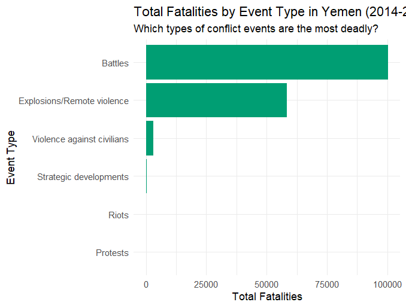

# ACLED Conflict Analysis Yemen
Conflict data analysis (ACLED) to identify trends and actor networks using R and Gephi.

## 🌍 Introduction

As an aspiring Data Analyst passionate about using data to address global humanitarian challenges, this project analyzes over a decade of conflict data for Yemen.

Using the **ACLED (Armed Conflict Location & Event Data Project)** dataset, this analysis identifies key temporal trends, maps the primary drivers of violence, and visualizes the complex network of actors involved in the conflict.

The goal is to demonstrate a complete data analysis workflow, from raw data processing in **R** to insightful network visualization in **Gephi**.

## 🛠️ Tools & Skills Demonstrated

* **Data Manipulation & Analysis:** R (using `dplyr` and `data.table` for 93,000+ rows)
* **Data Visualization:** R (`ggplot2` for time-series and categorical plots)
* **Time Series Analysis:** R (`lubridate` for date manipulation and aggregation)
* **Network Analysis & Visualization:** Gephi (using ForceAtlas 2, Modularity, and PageRank)

---

## 📊 Project Workflow

This project follows a structured 5-step data analysis pipeline:

1.  **Data Collection:** Downloaded the ACLED dataset, filtering for all events in **Yemen** from January 2014 to the present.
2.  **Data Cleaning (in R):**
    * Loaded the ~94,000 event dataset efficiently using `data.table::fread()`.
    * Converted the `event_date` column to a proper date format using `lubridate::ymd()`.
    * Selected only the relevant columns for analysis (e.g., `event_type`, `actor1`, `actor2`, `fatalities`).
3.  **Exploratory Data Analysis (EDA) (in R):**
    * Performed time-series analysis to plot total fatalities per month.
    * Conducted categorical analysis to identify the most lethal event types.
4.  **Network Preparation (in R):**
    * Based on the EDA, filtered the dataset to focus *only* on the key conflict drivers ("Battles" and "Explosions/Remote violence").
    * Transformed the data into `nodes` (unique actors) and `edges` (interactions, weighted by event count and total fatalities) dataframes.
5.  **Network Visualization (in Gephi):**
    * Imported the `nodes.csv` and `edges.csv` files.
    * Applied a **ForceAtlas 2** layout to spatialize the network.
    * Calculated **Modularity** (to find factions/communities) and **PageRank** (to find key actors).
    * Filtered out low-ranking nodes to reduce noise and reveal the core conflict structure.

---

## 📈 Key Findings & Visualizations

### 1. Conflict Peaked in 2018-2019

The time-series analysis shows that while the conflict has been consistent, the period of most intense violence (in terms of fatalities) occurred between 2018 and 2019. A clear de-escalation trend is visible from 2020 onwards, though monthly volatility remains high.

### 2. "Battles" & "Explosions" Drive 97% of All Fatalities

The analysis of event types reveals that "Battles" and "Explosions/Remote violence" are overwhelmingly the most lethal event types. Together, they account for **over 97% of all fatalities** in the dataset. This discovery was critical in justifying the focus of the network analysis.

### 3. Visualizing the Core Conflict Network

The final network graph visualizes the key actors and their relationships, filtered to show only the "Battles" and "Explosions" identified above.

* **Node Size (PageRank):** Larger nodes are more central/important actors in the conflict.
* **Color (Modularity):** Nodes of the same color represent a "community" or faction that interacts more frequently with each other than with other groups.

This visualization successfully untangles the complex web of interactions, revealing the core protagonists of the war.

*(IMPORTANTE: Sostituisci "yemen_network_final.png" con il nome esatto della tua immagine di rete)*
``

---

## 📁 Project Structure

The repository is structured for clarity and reproducibility:
